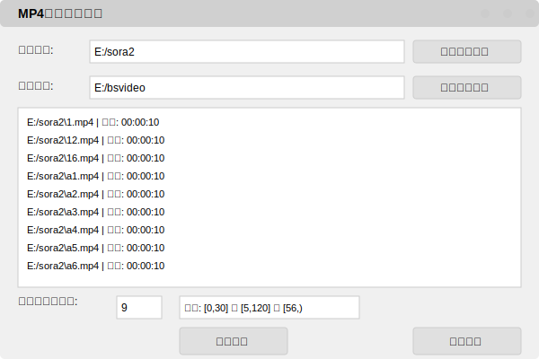

# MP4文件拷贝工具

这是一个用于从指定目录提取特定时长MP4文件并进行复制或移动操作的桌面程序。程序提供图形界面，支持精确的时长过滤、可视化文件列表和操作进度显示。

## 项目架构

本项目采用**清洁架构(Clean Architecture)**设计，实现了关注点分离和依赖倒置原则，使代码结构更加清晰、可维护和可扩展。项目按照以下层次组织：

- **核心层(Core)**：定义业务实体和接口
- **用例层(Use Cases)**：实现业务逻辑
- **接口适配器层(Interfaces)**：连接核心和外部依赖
- **框架层(Frameworks)**：提供外部接口和依赖注入

## 应用界面

以下是MP4文件拷贝工具的界面截图：



## 功能特性
- 选择输入目录（递归查找所有子目录中的MP4文件）
- 选择输出目录
- 显示输入目录中所有MP4文件及其时长
- 自定义时长范围过滤（支持最小和最大时长设置）
- 两种操作模式：
  - 复制模式：将符合条件的文件复制到输出目录
  - 移动模式：将符合条件的文件移动到输出目录
- 实时显示符合条件的文件数量
- 操作过程中文件高亮显示
- 完善的错误处理和用户提示
- 目录容错检查：确保输入/输出目录非空且不相同

## 环境要求
- Python 3.x（运行源代码）
- 兼容系统：Windows 7/10/11

## 项目结构

```
src/
├── core/              # 核心层
│   ├── entities.py    # 业务实体定义（VideoFile, FilterCriteria等）
│   └── ports.py       # 抽象接口定义（仓库、服务接口等）
├── use_cases/         # 用例层
│   └── video_file_processor.py  # 视频文件处理用例
├── interfaces/        # 接口适配器层
│   ├── file_system_adapter.py    # 文件系统适配器
│   ├── video_repository_adapter.py # 视频仓库适配器
│   └── gui_adapter.py             # GUI适配器
└── frameworks/        # 框架层
    ├── gui_app.py     # GUI应用实现
    └── main.py        # 程序入口和依赖注入
```

### 各层职责说明

- **核心层(Core)**：
  - 定义业务实体和数据模型
  - 声明抽象接口，实现依赖倒置
  - 包含领域规则和不变量

- **用例层(Use Cases)**：
  - 实现具体业务流程
  - 协调不同组件完成任务
  - 仅依赖核心层的抽象接口

- **接口适配器层(Interfaces)**：
  - 实现核心层定义的接口
  - 将外部依赖适配到内部接口
  - 处理技术细节（如文件系统、视频处理）

- **框架层(Frameworks)**：
  - 提供用户界面和交互
  - 管理依赖注入和组件组装
  - 连接所有层并启动应用

## 清洁架构优势

采用清洁架构设计带来以下好处：

- **可测试性**：业务逻辑与外部依赖解耦，便于单元测试
- **可维护性**：关注点分离，代码职责清晰
- **可扩展性**：可以轻松替换实现而不影响核心业务逻辑
- **灵活性**：可以根据需要替换UI框架、存储方式等外部组件
- **依赖流向控制**：依赖始终从外层向内层流动，核心业务不受外部变化影响

## 安装依赖
```bash
pip install -r requirements.txt
```

## 使用方法

### 运行源代码
1. 确保已安装所有依赖
2. 运行程序：`python cpymp4.py`

### 使用可执行文件
可直接运行 `dist/MP4CopyTool.exe`，无需安装Python环境

### 操作步骤
1. 点击「选择输入目录」按钮，选择包含MP4文件的目录
2. 点击「选择输出目录」按钮，选择目标目录
3. 在「时长范围（秒）」输入框中设置过滤条件：
   - 最小值输入框：设置最短时长（默认0秒）
   - 最大值输入框：设置最长时长（留空表示无上限）
   - 示例：输入 (0,30] 表示选择0-30秒的视频
4. 选择操作方式：
   - 点击「开始拷贝」进行文件复制
   - 点击「开始移动」进行文件移动
5. 操作完成后会显示成功数量的提示

## 时长过滤规则
- 左边界为开区间，右边界为闭区间
- 例如：(55,120] 表示时长大于55秒且小于等于120秒的视频
- 支持半无限区间，如 [56,) 表示时长大于等于56秒的视频

## 注意事项
- 请确保输入目录包含MP4文件
- 输出目录需要有写入权限
- 视频文件时长判断可能存在微小误差
- 移动操作将从原位置删除文件，请谨慎使用
- 执行大量文件操作时，进度显示可能需要一定时间完成